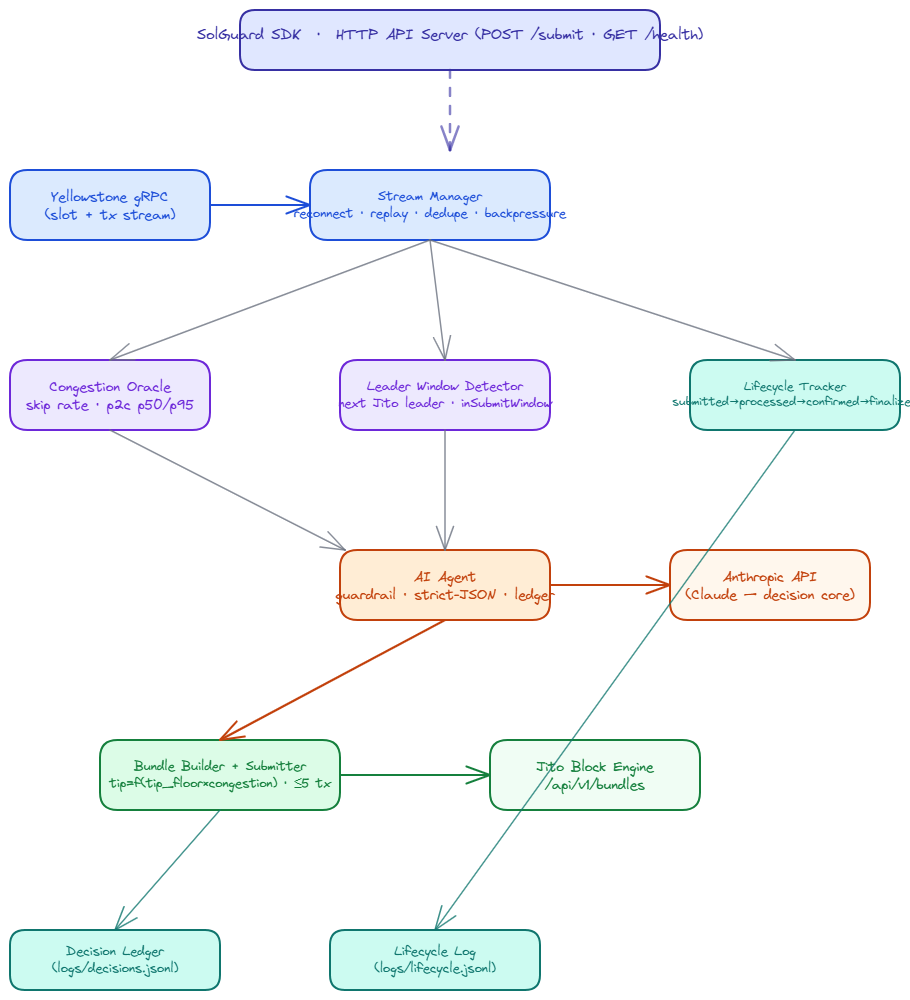

# SolGuard — Autonomous Bundle Intelligence Stack

> A traffic-aware GPS for Solana transactions. SolGuard watches the network in
> real time, submits Jito bundles only into valid leader windows, prices tips
> dynamically from live data, tracks every transaction across all commitment
> levels, classifies failures, and uses an **AI agent** to own the
> retry-under-fault decision with fully auditable reasoning.

SolGuard ships as two things at once:
- **Infrastructure / SDK** — a `SolGuard` class developers import into their trading bot, DEX aggregator, or NFT tool. They call `submit(tx)` and get back a landing result + full lifecycle. The stack handles tipping, bundling, confirmation, AI retry.
- **Demo dashboard** — a terminal UI (`pnpm start`) that visualises the running stack for judges and ops teams. It is the _window into_ the infrastructure, not the product itself.

**Bounty:** Advanced Infrastructure Challenge — Build a Smart Transaction Stack (Superteam Nigeria)  
**Docs:** [`PRD.md`](./PRD.md) · [`ARCHITECTURE.md`](./ARCHITECTURE.md) · [`AGENT.md`](./AGENT.md) · [`docs/`](./docs/)

---

## What it does

| Capability               | How                                                                                 |
| ------------------------ | ----------------------------------------------------------------------------------- |
| Watches the network live | Yellowstone gRPC slot/tx stream (source of truth for landing)                       |
| Picks the right moment   | Leader-window detector submits only into Jito leader windows                        |
| Pays the right tip       | Tip derived from live `tip_floor` × congestion multiplier — **zero hardcoded tips** |
| Tracks what happened     | Four-stage lifecycle (submitted → processed → confirmed → finalized) with deltas    |
| Knows why it failed      | Failure classifier (expired blockhash, fee too low, compute, leader skip, sim fail) |
| Decides what to do next  | AI agent (Claude) returns strict-JSON retry decisions, guardrailed + logged         |
| Exposes it as infra      | Programmatic `SolGuard` SDK class + HTTP API server (`POST /submit`, `GET /health`) |

---

## Architecture (overview)



<details>
<summary>ASCII diagram</summary>

```
Yellowstone gRPC ─▶ Stream Manager ─▶ ┬─▶ Congestion Oracle ─┐
 (reconnect/replay/dedupe/backpressure)├─▶ Leader Detector    ├─▶ AI Agent ─▶ Bundle Builder ─▶ Jito Block Engine
                                        └─▶ Lifecycle Tracker ─┘   (guardrail)   (dynamic tip)
                                                                        │
                                               Decision Ledger + Lifecycle Log (append-only JSONL)
                                                                        │
                                          SolGuard SDK / HTTP API (src/sdk, src/server.ts)
```
</details>

Full detail + interactive diagrams: [`ARCHITECTURE.md`](./ARCHITECTURE.md).

---


## Developer integration

The real consumers of SolGuard are developers — trading bots, DEX aggregators, NFT minters — who need transactions to land reliably without building retry/tip/confirmation infrastructure themselves.

### As a library (import)

```typescript
import { SolGuard } from './src/index.js';

const guard = new SolGuard(); // reads WALLET_SECRET_KEY + credentials from env
await guard.start();           // connects Yellowstone stream, warms up oracle

// Pass instructions, unsigned tx, or a pre-signed base64 tx:
const result = await guard.submit([myTransferInstruction]);

if (result.landed) {
  console.log(`Landed at slot ${result.slot} — sig ${result.signature}`);
} else {
  console.error(`Failed: ${result.error}`);
  // result.lifecycle has every stage, delta, and AI decision recorded
}
```

**What `submit()` accepts:**

| Input | SolGuard behaviour |
|---|---|
| `TransactionInstruction[]` | Compiles, signs with `WALLET_SECRET_KEY`, auto-refreshes blockhash on retry |
| `VersionedTransaction` / `Transaction` (unsigned) | Signs with `WALLET_SECRET_KEY`, auto-refreshes |
| Pre-signed transaction (browser wallet) | Sends as-is; aborts with clear error if blockhash refresh needed (can't re-sign) |
| Base64 / Base58 string | Deserializes then routes as above |

### As an HTTP API

```bash
# Start the API server
pnpm server            # production
pnpm server:watch      # hot-reload
PORT=3500 pnpm server  # custom port

# Submit a transaction
curl -X POST http://localhost:3000/submit \
  -H "content-type: application/json" \
  -d '{"transaction": "<base64-encoded-tx>", "urgency": "high"}'

# Health check (Render / Railway / Fly.io compatible)
curl http://localhost:3000/health
# → {"status":"healthy","initialized":true,"streamMetrics":{...},"congestion":{...}}
```

---

## Quick start

> Package manager: **pnpm** (≥9). Node ≥20.

```bash
pnpm install
cp .env.example .env      # then fill in credentials
pnpm typecheck            # verify the build

# Demo / judge view
pnpm start                # terminal dashboard (stream + congestion + bundles live)
pnpm live --submit        # full live pipeline with real submissions (spends SOL)

# Developer integration
pnpm server               # HTTP API server  POST /submit  GET /health
pnpm server:watch         # hot-reload dev mode

# Testing / validation
pnpm stream               # raw stream probe
pnpm bundle:dry           # build + sign bundle, no submission
pnpm fault:test           # end-to-end fault injection (offline mock)
pnpm fault:test:evidence  # same, but requires live ANTHROPIC_API_KEY
pnpm test                 # unit tests (54 tests)
pnpm lint:tips            # no-hardcoded-tip guard
```

### Required credentials (`.env`)

- `RPC_HTTP_URL` — Solana RPC (blockhash, leader schedule, tip accounts)
- `YELLOWSTONE_GRPC_URL` + `YELLOWSTONE_X_TOKEN` — Geyser stream
- `JITO_BLOCK_ENGINE_URL` — regional Jito endpoint
- `WALLET_SECRET_KEY` — minimal hot wallet (Phase 2+)
- `ANTHROPIC_API_KEY` — AI agent (Phase 4+)

See [`.env.example`](./.env.example) for the full annotated list.

---

## Project status

Tracked phase-by-phase in [`TASK.md`](./TASK.md). All core phases complete and verified on mainnet-beta:
- **Stream** — Yellowstone gRPC connected, slot replay, backpressure, reconnect
- **Network** — Congestion oracle (64-slot window), Jito leader detector
- **Tips** — Live floor fetch + congestion-multiplied dynamic tip, zero hardcoded values
- **Bundle** — Jito block engine submission; RPC fallback on `Invalid` detection (< 2 s)
- **Lifecycle** — 4-stage tracker (processed → confirmed → finalized), measured on-chain
- **AI Agent** — DeepSeek / Claude retry decisions, strict-JSON guardrail, decision ledger
- **API** — `POST /submit`, `GET /health`, WebSocket + SSE bridge for live dashboard
- **Frontend** — React dashboard with Yellowstone stream feed, live mode, bundle pipeline

---

## The three required questions

**Q1 — What does the delta between `processed_at` and `confirmed_at` tell you about network health?**
_Measured live on mainnet-beta (slot 427,230,617, 2026-06-18): processed → confirmed = **432 ms** at a skip rate of ~0% (healthy window). Our congestion oracle accumulates this delta in a 64-sample rolling window; p50 rises to ~800 ms+ and the multiplier escalates tip recommendations when the network is under stress._

It measures how long the cluster took to reach supermajority vote on the block containing the transaction. A small delta (< 500 ms) indicates healthy, fast voting and low fork pressure; a large/widening delta indicates vote latency, fork churn, or validator degradation. SolGuard surfaces this as `pcDelta` in real time and adjusts the tip tier accordingly.

**Q2 — Why never use `finalized` commitment when fetching a blockhash for a time-sensitive transaction?**
A blockhash is valid for ~150 slots (~60s). `finalized` lags `confirmed` by ~32 slots (~13s), so fetching at finalized burns ~1/5 of the validity window before you submit. We fetch at `confirmed` to maximize usable validity while avoiding the revert risk of `processed`.

**Q3 — What happens to your bundle if the Jito leader skips their slot?**
The bundle is dropped — bundles are only processed while the scheduled Jito-Solana leader is producing; standard validators do not execute or forward them. We detect the skip from the slot stream, classify it as a bundle drop, and the agent resubmits targeting the next scheduled Jito leader window.

---

## Repository layout

```
src/
  sdk/
    solguard.ts  SolGuard class — programmatic API for developers (submit, start, stop, status)
  stream/        Stream Manager: connect, reconnect, replay, dedupe, ping, bounded queue
  network/       Congestion Oracle + Leader Window Detector
  tips/          tip_floor fetch + dynamic tip model (no hardcoded values)
  bundle/        Bundle builder + submitter + status reconciliation
  lifecycle/     4-stage tracker + failure classifier
  agent/         Contract, Anthropic call, guardrail, decision ledger
  faults/        Deterministic fault injector
  dashboard/     Terminal UI (demo / ops view)
  server.ts      HTTP API server  POST /submit  GET /health
  index.ts       Exports SolGuard SDK; runs terminal dashboard when executed directly
  live.ts        Full live pipeline with real submissions (pnpm live --submit)
scripts/         CI guards (no-hardcoded-tips) + fault-test harness
logs/            Append-only lifecycle.jsonl + decisions.jsonl (generated)
```

---

## License

MIT (see `LICENSE`).
