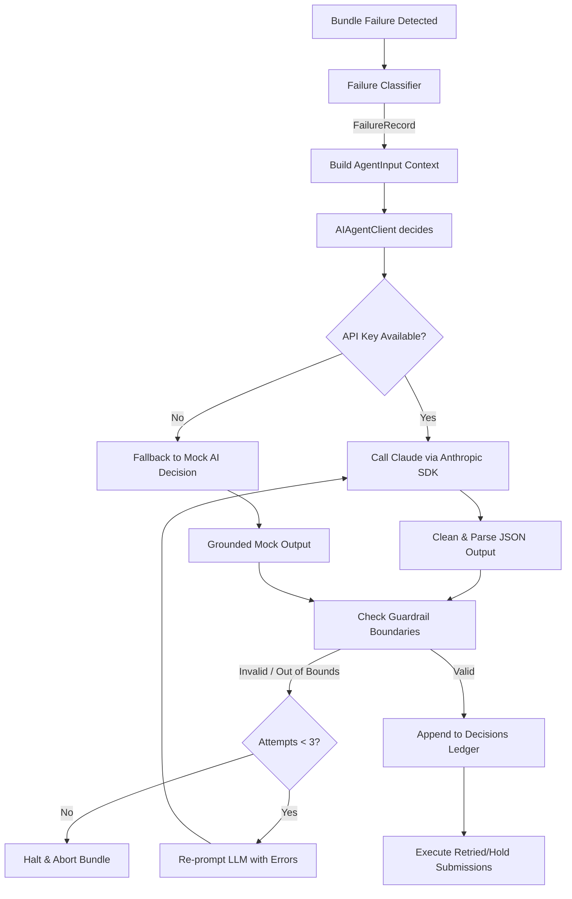

# Phase 4 AI Agent Documentation & Explanation

To enable Phase 5 (Fault Injection) and Phase 6 (Evidence) validation, the entire Phase 4 (AI Decision Agent + Ledger) foundation was implemented from scratch. This document details the architecture, design choices, and code modules introduced to fulfill Phase 4.

---

## 1. Architectural Role
The AI Agent layer serves as the central brain of the bundle pipeline. In compliance with **NFR-5 (Separation of Concerns)**, there are clear architectural boundaries:
- The core transaction stack does not embed retry heuristics; it only gathers network telemetry and hands the failure context to the agent.
- The AI Agent does not interact with the network, Solana RPC, or the Jito block engine directly; it only reads the input context and returns a decision.

---

## 2. Implemented Code Modules

The following files were created in `src/agent/`:

### 1. `src/agent/contract.ts`
Establishes the typescript typings and schema structures for input and output contracts defined in `AGENT.md`.
- **`AgentInput`**: Captures the failure event taxonomy (5 classes with evidence), the bundle parameters (attempt count, tip paid, submitted slot), the network telemetry (skip rate, processed-to-confirmed delta, Jito `tip_floor` distribution), and the historical attempts.
- **`AgentOutput`**: Defines the strict-JSON response format containing `diagnosis` (grounded in input signals), `root_cause` class, `action` (`retry`, `hold`, or `abort`), retry parameters (`refresh_blockhash`, `new_tip_lamports`, `submit_at_slot`, `max_blockhash_age_slots`), and a `confidence` score.
- **Validators**: Implements `validateAgentInput` and `validateAgentOutput` to reject structurally invalid payloads.

### 2. `src/agent/guardrail.ts`
Enforces safety boundaries on the agent's decisions to protect funds and ensure network compatibility without altering the decision:
- **Tip Checks**: Verifies `new_tip_lamports` is between the Jito `p25` floor and `TIP_CEILING_LAMPORTS` (safety ceiling).
- **Slot Range Checks**: Verifies `submit_at_slot` is in the future relative to the current slot, and within 150 slots (re-entry window).
- **Age Bounds**: Verifies `max_blockhash_age_slots` is $\le 150$ slots (the Solana maximum limit).

### 3. `src/agent/agent.ts`
Manages the prompt layout, Anthropic Claude SDK interactions, JSON clean-parsing, and the re-prompting loop:
- **System Prompt**: Enforces strict JSON return (no markdown wrapping, no conversational prose) and anti-disqualification constraints (diagnosis must mention real signals).
- **Re-prompt Loop**: On structure or guardrail validation errors, it automatically feeds the validation errors back to Claude (up to 3 times) to get a corrected decision.
- **Mock Fallback**: If `process.env.ANTHROPIC_API_KEY` is not present, it automatically uses a high-fidelity local decision engine that generates context-appropriate mock responses (e.g. refreshing blockhash for expired blockhash faults, escalating tips for fee-too-low faults). This guarantees off-chain testability.

### 4. `src/agent/ledger.ts`
Writes the audit trail for all agent calls to `logs/decisions.jsonl`. It logs the timestamp, trigger type (`real_failure` or `injected_fault`), the raw reasoning text, the validated decision parameters, the guardrail outcome (`accepted`, `re-prompted`, `rejected`), and the final outcome.

---

## 3. Workflow Flowchart

